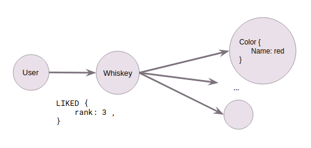

# Whis-key : Telegram Bot for Whiskey

In this project, we will create a telegram bot in order to handle multiple user interaction with a wiskey database.

## Description

With Whiskey-Bot, you can display the top 10 of the whiskies by alcohol percentage or by the number of likes. You can vote between 1 star and 5 stars a whisky, with this functionnality, Whiskey-Bot can recommend you and give your taste preferences. You can ask to Whiskey-Bot the details about a whisky in particular with the inline query. Likewise, you can ask to Whiskey-Bot to search in function of a range of alcohol percentage.

### How to use

* You need Telegram
* Search the bot typing '@Whis_key_bot'
* Start a conversation
* Enter your command and enjoy :D

### Available Commands

* ```/help``` : List all the commands below and describe this project.
* ```/top10highestpercentage``` : List the whiskeys with the highest percentage of alcohol.
* ```/taste``` : Shows the user's taste grouped by nose, body, palate and finish.
* ```/liked``` : List all whiskeys liked by the current user.
* ```/recommendwhiskies``` : List whiskeys recommended depending on the user's likes
* ```/searchbypercentalcohol <min> <max>```: List whiskeys with an alcohol percentage between the range ]min, max[

## Deploying
This bot uses both Neo4j and MongoDB for data persistence. Both can be started using docker-compose : ```docker-compose up```. 

To be able to run this project, you need to create a `.env` based on the `.env.example`

We can add data in our container with the command ``npm run ts-import``. 
``npm run ts-start`` allows you to run the server.

The bot is under the alias ```Whis-key```

## Botfather

Our application use inline query, we need to enable this in botfather. 
With `/setinline` enable this and add a placeholder message and `/setinlinefeedback` to enable to retrieve the feedback

We can add the available command with `/setcommands`. Your can copy paste the text in the file `commandsToAdd.txt` in botfather

## Technology Stack

- Typescript
- Telegram
- Neo4j
- MongoDB

## Implementation

### Data Model



#### Nodes

- Whisky
- Caracteristic
  - Body
  - Color
  - Finish
  - Nose
  - Palate
- User

#### Relationship

Each whisky has a relation with differents characteristics like taste, color, finishes, region, etc. The users have a relation with the whiskies they liked or not.

### Requests

#### Top 10 - Alcohol percentage

```neo4j
MATCH (w:Whiskey)
RETURN w, w.percent as perc
ORDER BY w.percent DESC
LIMIT 10
```

In this request, we just match any whiskies and we order by the alcohol percentage in decreasing order.

#### Top 10 - Whiskies liked

```neo4j
MATCH (u:User)-[l:LIKED]-(w:Whiskey)
WITH w.name as name, count(*) as times
WITH collect({name:name, times:times}) as rows, max(times) as max
UNWIND [row in rows WHERE row.times = max] as row
RETURN row.name as name, row.times as times
LIMIT 10
```
In this request, we match any whiskies and their corresponding 

### Recommend Whiskies

```neo4j
MATCH (:User{id:$userId})-[:LIKED]-(:Whiskey)-[]-(c)-[]-(w:Whiskey)
return c,w, rand() as r
ORDER BY r
limit 10
```

In this request, we return all whiskies which have same characteristics with the whiskies that the user has already liked.

### User taste

The request can be found in the file 'GraphDao.ts' between the lines 107 to 173. 

To identify the user preference, we assign a weight for each characteristic. We retrieve all characteristics liked by the user and compute his weight according to how many times he liked in his whiskies weighted with the rank.
To find his preference, we take the max weighted for each characteristic

### Whiskies liked by the user

```neo4j
match (:User{id: $userId})-[l:LIKED]-(w:Whiskey) return w, l.rank as rank
```

In this request, we match any whiskies liked by the user. 

### Number of likes for a Whiskey in particular

```neo4j
MATCH (:User{id: $userId})-[l:LIKED]-(:Whiskey{id: $whiskeyId}) RETURN l
```

In this request, we match all the relationships with an whiskey in particular and the likes

### Search by alcohol percentage

```neo4j
MATCH (n:Whiskey)
WHERE n.percent > toFloat($minPercent) AND n.percent < toFloat($maxPercent)
RETURN n LIMIT 10
```

In this request, we match any whiskies which have their alcohol percentage between a minPercent and maxPercent.

